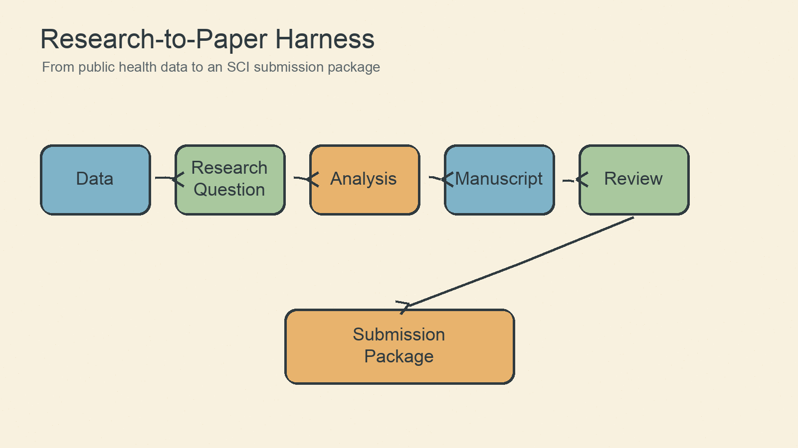
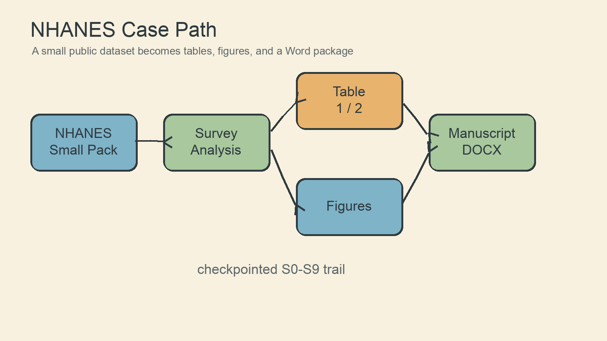

# ars-research-harness

一个把 AI 学术写作从“提示词输出”升级为“受控工程流程”的研究工作流项目。它以 NHANES 2017-2018 未诊断糖尿病论文为完整案例，展示如何从公共医学数据走到分析结果、表图、论文初稿、审稿模拟、修回和投稿前 Word 包。



## 这个项目解决什么问题

普通 AI 写论文很容易一次性跳过关键步骤：还没确认研究问题就跑分析，还没核对引用就写结论，还没审稿就生成“最终稿”。`ars-research-harness` 的核心是 checkpoint-first：

- 每个阶段只完成一个明确任务。
- 每个阶段都留下可检查产物。
- 进入下一阶段前必须有人确认。
- 所有阶段状态写入 `workflow-run.json`。
- validator 检查流程是否越级或缺少确认。

这让 AI 工作流更像一个可审计的科研流水线，而不是一次性的聊天输出。

## 快速开始

安装 Python 依赖，并确保 R 中已有 `haven`、`dplyr`、`readr`、`survey`：

```bash
python3 -m pip install -r requirements.txt
Rscript -e 'install.packages(c("haven", "dplyr", "readr", "survey"), repos="https://cloud.r-project.org")'
```

```bash
python3 scripts/download_nhanes_small_pack.py
Rscript scripts/run_nhanes_analysis.R
python3 scripts/generate_tables.py
Rscript scripts/generate_figures.R
python3 scripts/build_submission_docx.py
python3 harness/scripts/validate_checkpoint_workflow.py examples/nhanes-undiagnosed-diabetes/workflow-run.json
```

运行后重点查看：

- `examples/nhanes-undiagnosed-diabetes/workflow-run.json`
- `examples/nhanes-undiagnosed-diabetes/checkpoints/`
- `examples/nhanes-undiagnosed-diabetes/results/`
- `examples/nhanes-undiagnosed-diabetes/submission_package/manuscript_final_with_tables_figures.docx`

## S0-S9 工作流


| 阶段 | 目的 | 产物 |
|---|---|---|
| S0 | 明确目标、数据、边界 | intake checkpoint |
| S1 | 收敛研究问题 | research question |
| S2 | 制定方法和分析方案 | method plan |
| S3 | 执行数据分析 | results tables |
| S3b | 修正模型复杂度 | parsimonious model |
| S4 | 解释结果 | interpretation |
| S5 | 生成 IMRaD 大纲 | outline |
| S5b | 建立文献矩阵 | literature matrix |
| S6 | 写英文 SCI 初稿 | manuscript draft |
| S7 | 数据、引用、论断完整性核查 | integrity report |
| S7b | 清理引用和参考文献 | citation-clean draft |
| S8 | 模拟审稿和修回路线 | reviewer report |
| S8b | 实施 major revision | revised manuscript |
| S9 | 生成投稿前包 | DOCX, tables, figures, checklist |

## Harness 架构


这个项目把 Academic Research Suite 包装成一个本地 workflow harness：

- `harness/checkpoint-first-workflow.md`：阶段规则和执行边界。
- `harness/templates/workflow-run.template.json`：状态文件模板。
- `harness/scripts/validate_checkpoint_workflow.py`：检查阶段状态。
- `examples/nhanes-undiagnosed-diabetes/`：完整 NHANES 案例。
- `scripts/`：可复用执行入口。

## NHANES 案例



示例研究问题：在自报无糖尿病的美国成年人中，HbA1c 定义的未诊断糖尿病患病率及其心代谢、生活方式相关因素是什么？

案例包括：

- NHANES 2017-2018 小包数据。
- R survey 加权分析。
- Table 1、Table 2、Figure 1、Figure 2。
- 引用核查和修回记录。
- 最终通用 SCI Word 稿。

## 与普通 prompt/skill 的区别

| 维度 | 普通 prompt | 普通 skill | workflow harness |
|---|---|---|---|
| 阶段边界 | 弱 | 中 | 强 |
| 状态记录 | 通常没有 | 不一定 | 必须有 |
| 人工确认 | 可选 | 可选 | 阶段门禁 |
| 可追溯性 | 弱 | 中 | 强 |
| 复刻性 | 依赖聊天上下文 | 依赖说明 | 依赖文件和状态机 |

## 重要声明

- 本项目是科研工作流和教学模板，不保证论文被 SCI 接收。
- NHANES 是复杂抽样调查；正式推断必须使用权重、分层和 PSU。
- AI 生成的研究文本需要人工统计、伦理、引用和期刊格式复核。
- NHANES 数据来自 CDC/NCHS public-use files，使用者应遵守原始数据来源说明和引用规范。

English documentation: [README.md](README.md)
